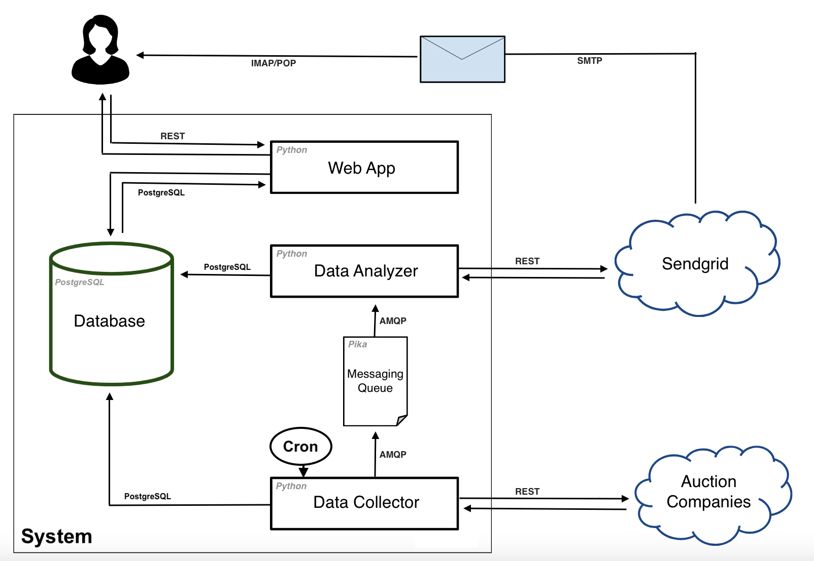

# Foreclosure Deals Notifier (foredeals) - CU MSCS CSCA028 Final Project

## Table of Contents
- [Introduction](#introduction)
- [Requirements](#requirements)
- [Architecture](#architecture)
- [Tests and Testing](#tests-and-testing)
- [Continuous Integration and Continuous Deployment](#continuous-integration-and-continuous-deployment)
- [Production Monitoring and Instrumenting](#production-monitoring-and-instrumenting)
- [Installation](#installation)
- [Usage](#usage)

## Introduction

Welcome to the GitHub repository for the "Foreclosure Deals Notifier" application, developed as the final project for CU MSCS CSCA028. This application addresses the challenge of identifying affordable foreclosure auctions and comparing prices against local real estate markets. Tailored for real state buyers in the US, it provides valuable insights sourced from specialized companies and includes an advanced notification system for timely alerts aligned with users' investment preferences.

This repository provides insights into the architecture and development concepts behind the application, offering an overview of the decision-making process. The project's code is accessible within the repository, and a demo of the product can be found in this link: http://link

## Requirements

Functional Requirements:

Application must encompass all essential features to efficiently deliver value to users:

- Almost real-time data fetching for foreclosure auctions
- Price analysis compared to local real estate markets
- Notification system aligned with users' investment preferences
- User-friendly interface for broad accessibility

Non-Functional Requirements:

The system should efficiently handle a significant load of concurrent connections, run on small Heroku instances, and ensure reliable data retrieval and analysis. It must be prepared to scale in case of unexpected sudden popularity.

- 1000 email registrations per minute.
- 1000 auction listing request per minute.
- Page load less than 3s including images.

## Architecture

A design approach has been taken to carefully structure components and facilitate communication between services, ensuring a balanced trade-off between performance and data consistency. The project architecture follows the App Continuum model, incorporating multiple applications and components within a unified single repository, with a specific focus on service-to-service communication. The system is composed of modular Python applications hosted on the Heroku platform, seamlessly integrated through Continuous Integration and Continuous Deployment pipelines.

### Database
The application employs a SQL database, specifically PostgreSQL, which is utilized both on Heroku or locally during development. This decision comes from the structured nature of the application's data, which involves determining zip codes, prices, and investment preferences. The emphasis is on prioritizing data consistency over availability or horizontal scaling, aligning with the principles of the ACID framework (Atomicity, Consistency, Isolation, Durability).

### Web App
The web application serves as a straightforward tool for database queries, displaying results, email registration, and configuring investment preferences. Developed in Python using the Flask framework, it leverages SQLAlchemy to manage the PostgreSQL database. This choice is driven by the pursuit of simplicity, versatility, and high performance.

### Data Collector
The data collector component retrieves auction information from various company websites, processes the data into a structured format, and stores it in the database. Overcoming challenges related to accessing websites and ensuring proper rendering of JavaScript content is addressed through the use of Puppeteer (specifically, pyppeteer in the context of this Python application). Parsing is achieved using BeautifulSoup, while SQLAlchemy and Flask are incorporated for easier integration.

### Data Analyzer
This component conducts a comparison between auction prices and local market rates, utilizing a Zillow real estate database for estimating property values in local markets. Although the current comparison method is straightforward, there exists an opportunity to delve into a more advanced algorithmic approach during this phase. Furthermore, the component is tasked with sending requests to Sendgrid for the delivery of email notifications.

This component is designed as a standalone entity within the system, particularly advantageous when connected to the messaging queue. This configuration enables it to efficiently manage a heavier load of tasks, functioning seamlessly in batch processing. The implementation is also in the form of a Python application.

### Sendgrid API
The app is utilizing Sendgrid's RESTful API. This component facilitates the sending of email notifications containing auction prices tailored to users' specified investment preferences. The implementation involves employing their Python client to execute REST requests against their servers.

### Auction Companies
Auction Companies serve as the primary source for real estate auction information, providing details such as prices, states, cities, and dates. Access to this information is accessed through web interface.

### Cron
A scheduled cron job activates the Data Collector component at regular intervals. Setting the interval to one hour or more is recommended, as it ensures a balance between obtaining up-to-date information and preventing strain on third-party servers. This setup is achieved through Heroku Scheduler, an addon that can be configured through the web interface to directly execute jobs on the Data Collector component. This service was chosen due to its simplicity and the additional advantage of being readily accessible on Heroku at no cost.

### Messaging Queues
Event collaboration messaging enables seamless batch processing for the Data Analyzer, efficiently handling heavy workloads, improving availability and performance. Utilizing RabbitMQ through pika in Python integrates the Data Collector and Data Analyzer Python apps effortlessly. Running on Heroku provides an added benefit, allowing cost-effective integration with the affordable CloudAMQP Heroku add-on.

## Tests and Testing

Tests have been conducted to verify both functional and non-functional requirements.

Functionality (through pytest Tests):

- Unit tests: covered most methods used across components.
- Integration tests: assessed the integration of components.
- Mock objects: employed for specific tasks, such as recreating Pyppeteer fetching.

Performance:

- K6 benchmarking tool: developed for validating non-functional requirements.
- Chrome Developer Tools: used as an additional tool to assess loading times.

## Continuous Integration and Continuous Deployment
In order to automate and streamline the software development pipeline for the application, a Heroku and Github setup was implemented. Part of the configuration is done thorugh the web interface and other through the Yaml file in the repo. The goal is to be able to integrate code with the team as fast as possible to avoid bugs, and to not push faulty code to production.

## Production Monitoring and Instrumenting
- A health check endpoint, returning a JSON response, has been implemented.
- Basic logging for errors and events has been incorporated using Python's built-in logging, with configurations to persistently store the logs.

## Installation

Locally:

- Install Python's venv module
sudo apt install python3-venv

- Go to root of project (/foredeals), create the virtual environment and source the activation script
python3 -m venv venv && source venv/bin/activate

- Install Flask and other dependencies
pip install -r requirements.txt

- Tell system where flask app is
export FLASK_APP=src/applications/web_app/app.py

- Setup postgresql
brew install postgresql
brew services start postgresql

- Check .env vars, you might not need to change it

- Setup database
psql -f migrations/foredeals.sql

- Run migrations
flask db upgrade

## Usage

Locally:

- Run the Web App locally
flask run

- Run Data Collector
python3 src/applications/data_collector/CollectData.py

